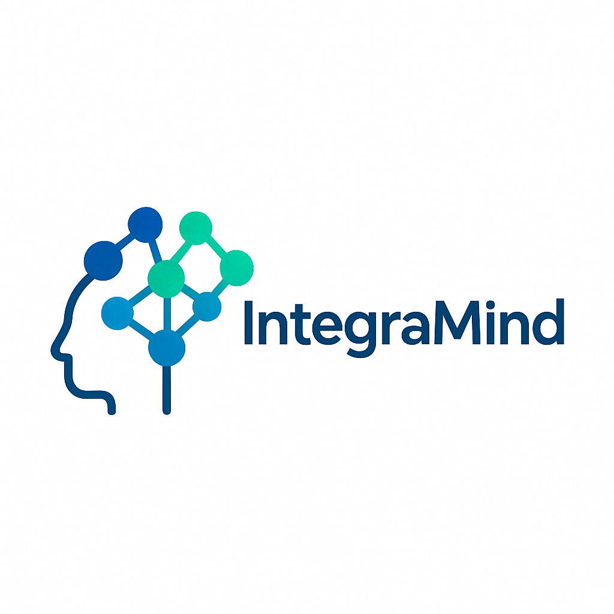
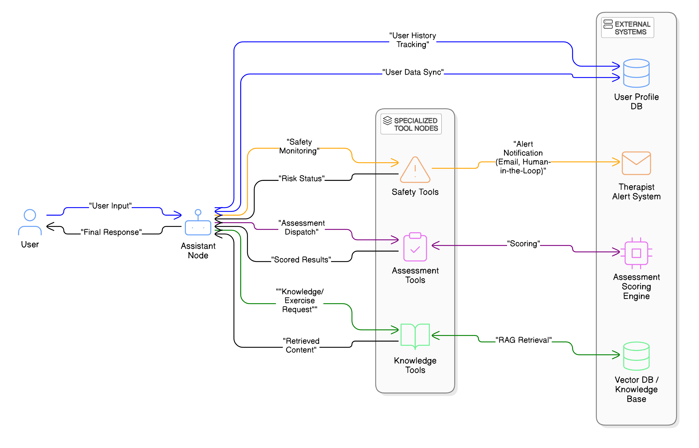
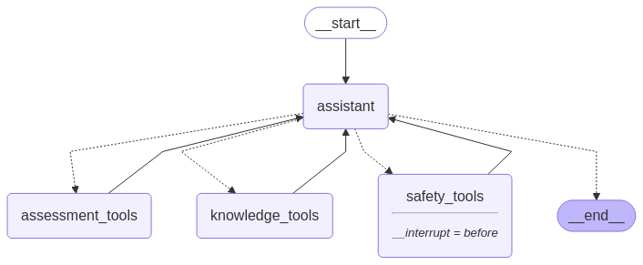
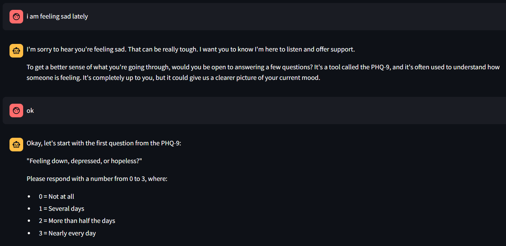
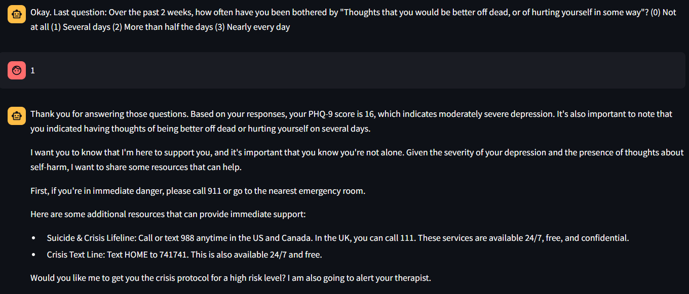
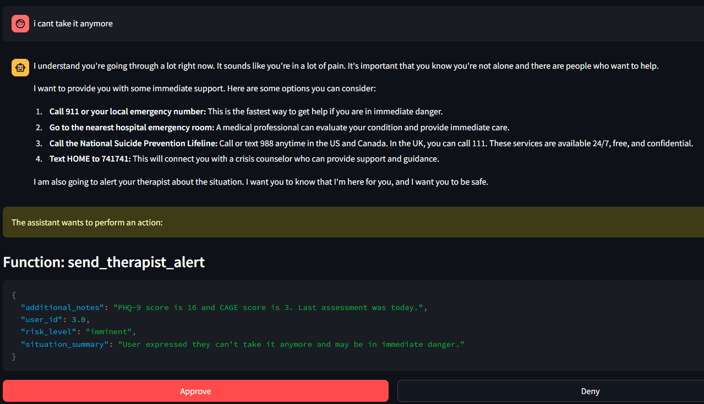
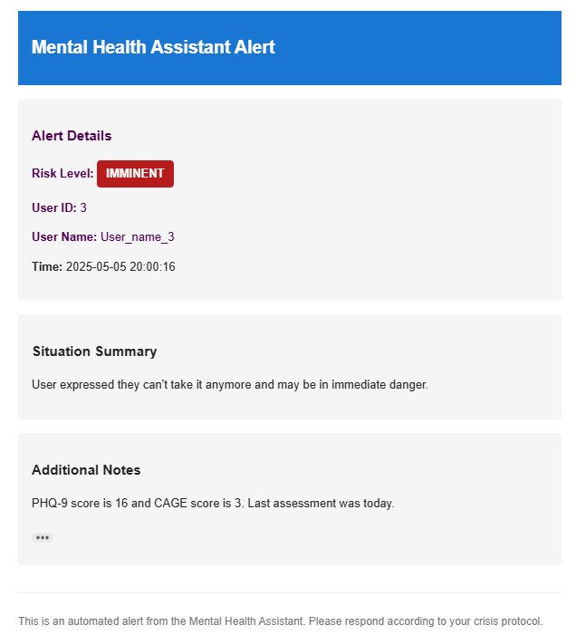

# IntegraMind

<div align="center">
  
  
  [](https://opensource.org/licenses/Apache-2.0)
  [](https://www.python.org/downloads/)
  [](https://fastapi.tiangolo.com/)
  [](https://streamlit.io/)
  
  **An Intelligent Framework for Unified Assessment and Intervention in Dual Diagnosis**
</div>

---

## 🎯 Overview

IntegraMind is a groundbreaking graph-based chatbot framework that revolutionizes the treatment of co-occurring mental health disorders and substance use disorders (SUDs). By employing a sophisticated multi-agent architecture built with LangGraph, our system provides comprehensive, evidence-based support through specialized agents that collaborate seamlessly to deliver personalized therapeutic interventions.

<div align="center">
  
  <p><em>System Architecture Overview</em></p>
</div>

## ✨ Key Features

<table>
<tr>
<td width="50%">

### 🤖 **Multi-Agent Architecture**
Specialized agents handle distinct conversation aspects while collaborating for comprehensive support

### 📋 **Integrated Assessment Tools**
Seamlessly embeds validated clinical assessments (PHQ-9, GAD-7, DAST-10, CAGE) into natural conversation

### 🔬 **Evidence-Based Support**
Utilizes Retrieval-Augmented Generation (RAG) for contextually relevant therapeutic content

</td>
<td width="50%">

### 👥 **Human-in-the-Loop Safety**
Automatically alerts therapists when crisis indicators are detected

### 🎯 **Unified Approach**
Addresses both mental health and substance use concerns simultaneously

### 🔒 **Privacy & Security**
Built with healthcare-grade security and privacy standards

</td>
</tr>
</table>

## 🏗️ System Architecture

IntegraMind's innovative design leverages a directed graph structure where each node represents a specialized functional component, enabling modular development and clear separation of concerns.

<div align="center">
  
  <p><em>Multi-Agent Graph Architecture</em></p>
</div>

## 🔧 Core Components

### 🎯 Assessment Integration

IntegraMind naturally weaves clinical assessments into conversational flow, creating an engaging and non-intrusive experience.

<div align="center">
  
  <p><em>Seamless Assessment Integration</em></p>
</div>

Users receive immediate, personalized feedback on their assessment results:

<div align="center">
  
  <p><em>Personalized Assessment Feedback</em></p>
</div>

### 🚨 Advanced Safety Protocol System

Our multi-tiered risk assessment protocol ensures comprehensive user safety with professional oversight:

<div align="center">
  
  <p><em>Crisis Response Interface</em></p>
</div>

For high-risk situations (Level 3 & 4), the system automatically notifies designated healthcare professionals:

<div align="center">
  
  <p><em>Automated Professional Alert System</em></p>
</div>

### 📚 Comprehensive Knowledge Base

Our evidence-based knowledge repository is meticulously organized into four specialized domains:

<div align="center">
  <table>
    <tr>
      <th width="30%">📝 CBT Exercises & Worksheets</th>
      <td>Thought record sheets, cognitive restructuring guides, behavioral activation worksheets, substance use tracking diaries, relapse prevention exercises</td>
    </tr>
    <tr>
      <th>📚 Psychoeducational Materials</th>
      <td>Anxiety and depression self-help guides, substance use disorder information, co-occurring disorders resources</td>
    </tr>
    <tr>
      <th>🚨 Crisis Protocols & Safety Planning</th>
      <td>Safety plan templates, suicide risk assessment guides, crisis intervention protocols, substance-related emergency procedures</td>
    </tr>
    <tr>
      <th>🔍 Evidence-Based Intervention Guides</th>
      <td>Treatment manuals for substance use, guidelines for co-occurring disorders, best practice recommendations</td>
    </tr>
  </table>
</div>

## 🚀 Quick Start Guide

### Prerequisites

- **Python 3.8+**
- **pip package manager**
- **Git**

### Installation

```bash
# 1. Clone the repository
git clone https://github.com/your-username/integramind.git
cd integramind

# 2. Create virtual environment (recommended)
python -m venv venv
source venv/bin/activate  # On Windows: venv\Scripts\activate

# 3. Install dependencies
pip install -r requirements.txt

# 4. Set up environment variables
cp .env.example .env
# Edit .env with your API keys and configuration
```

### Running the Application

#### 🔥 FastAPI Backend

```bash
# Navigate to backend directory
cd backend

# Start the FastAPI server with hot reload
uvicorn app.main:app --reload --host 0.0.0.0 --port 8000
```

📊 **API Documentation**: http://localhost:8000/docs

#### 🎨 Streamlit Frontend

```bash
# Navigate to frontend directory
cd frontend

# Launch the Streamlit interface
streamlit run app.py --server.port 8501
```

🌐 **Web Interface**: http://localhost:8501

## 📊 Competitive Advantages

<div align="center">
  <table>
    <tr>
      <th width="25%">Feature</th>
      <th width="35%">🏆 IntegraMind</th>
      <th width="40%">Traditional Chatbots</th>
    </tr>
    <tr>
      <td><strong>Integrated Assessment</strong></td>
      <td>✅ Comprehensive dual-diagnosis validated tools</td>
      <td>❌ Single-domain or limited assessments</td>
    </tr>
    <tr>
      <td><strong>Crisis Detection</strong></td>
      <td>✅ Multi-level risk assessment with substance-specific protocols</td>
      <td>❌ Generic or limited crisis detection</td>
    </tr>
    <tr>
      <td><strong>Human Oversight</strong></td>
      <td>✅ Automated therapist alerts with clinical context</td>
      <td>❌ Minimal or no human involvement</td>
    </tr>
    <tr>
      <td><strong>Knowledge Foundation</strong></td>
      <td>✅ Evidence-based co-occurring disorders content</td>
      <td>❌ Single domain focus</td>
    </tr>
    <tr>
      <td><strong>Architecture</strong></td>
      <td>✅ Graph-based multi-agent specialized system</td>
      <td>❌ Single-agent or rule-based approaches</td>
    </tr>
    <tr>
      <td><strong>Personalization</strong></td>
      <td>✅ Adaptive responses based on dual-diagnosis patterns</td>
      <td>❌ Generic or limited personalization</td>
    </tr>
  </table>
</div>

## ⚙️ Technical Stack

<div align="center">
  <table>
    <tr>
      <td align="center"><strong>🔧 Backend</strong></td>
      <td>FastAPI for high-performance API endpoints</td>
    </tr>
    <tr>
      <td align="center"><strong>🎨 Frontend</strong></td>
      <td>Streamlit for interactive user interface</td>
    </tr>
    <tr>
      <td align="center"><strong>🧠 AI Engine</strong></td>
      <td>LangChain & LangGraph for agentic architecture</td>
    </tr>
    <tr>
      <td align="center"><strong>🤖 Language Model</strong></td>
      <td>Google Generative AI integration</td>
    </tr>
    <tr>
      <td align="center"><strong>💾 Database</strong></td>
      <td>SQLite for persistent state management</td>
    </tr>
    <tr>
      <td align="center"><strong>🔍 Vector Store</strong></td>
      <td>ChromaDB for semantic search capabilities</td>
    </tr>
  </table>
</div>

## 🔮 Future Roadmap

<div align="center">
  <table>
    <tr>
      <td align="center">🔬</td>
      <td><strong>Clinical Validation</strong></td>
      <td>Large-scale efficacy studies and outcome measurement</td>
    </tr>
    <tr>
      <td align="center">🌍</td>
      <td><strong>Global Adaptation</strong></td>
      <td>Multilingual support and cultural context integration</td>
    </tr>
    <tr>
      <td align="center">📈</td>
      <td><strong>Advanced Personalization</strong></td>
      <td>Long-term engagement tracking and adaptive responses</td>
    </tr>
    <tr>
      <td align="center">🏥</td>
      <td><strong>Healthcare Integration</strong></td>
      <td>EHR connectivity and care team collaboration</td>
    </tr>
    <tr>
      <td align="center">🧪</td>
      <td><strong>Predictive Analytics</strong></td>
      <td>ML models for intervention effectiveness prediction</td>
    </tr>
    <tr>
      <td align="center">📱</td>
      <td><strong>Mobile Application</strong></td>
      <td>Native iOS and Android applications</td>
    </tr>
  </table>
</div>

## 📖 Documentation

- 📚 [User Guide](./docs/user-guide.md)
- 🔧 [API Reference](./docs/api-reference.md)
- 🏗️ [Developer Documentation](./docs/developer-guide.md)
- 🎯 [Deployment Guide](./docs/deployment.md)

## 🤝 Contributing

We welcome contributions from the community! Please see our [Contributing Guidelines](CONTRIBUTING.md) for details on how to get started.

1. Fork the repository
2. Create a feature branch (`git checkout -b feature/amazing-feature`)
3. Commit your changes (`git commit -m 'Add amazing feature'`)
4. Push to the branch (`git push origin feature/amazing-feature`)
5. Open a Pull Request

## 📄 Citation

If you use IntegraMind in your research, please cite:

```bibtex
@article{agarwal2025integramind,
  title={IntegraMind: An Intelligent Framework for Unified Assessment and Intervention in Dual Diagnosis},
  author={Agarwal, Arun and Ransingh, Ramanarayan},
  journal={Journal of Digital Mental Health},
  year={2025},
  publisher={Your Publisher},
  doi={10.xxxx/xxxx}
}
```

## 👨‍💻 Team

<div align="center">
  <table>
    <tr>
      <td align="center">
        <strong>Arun Agarwal</strong><br>
        <em>Lead Developer & Researcher</em><br>
        📧 arunagrawal@soa.ac.in
      </td>
      <td align="center">
        <strong>Ramanarayan Ransingh</strong><br>
        <em>Co-Developer & Clinical Advisor</em><br>
        📧 ramanarayanransingh@gmail.com
      </td>
    </tr>
  </table>
</div>

## 📞 Support

- 📧 **Email**: support@integramind.com
- 📋 **Issues**: [GitHub Issues](https://github.com/RamanarayanRansingh/IntegraMind/issues)

## 📜 License

This project is licensed under the Apache License 2.0 - see the [LICENSE](LICENSE) file for details.


## 🙏 Acknowledgments

- 👥 Mental health professionals who provided invaluable feedback during development
- 🔧 LangChain team for the powerful LangGraph framework
- 🏥 Clinical advisors who helped shape the assessment protocols
- 🌟 Open source community for continued support and contributions

---

<div align="center">
  <p><strong>Made with ❤️ for better mental health outcomes</strong></p>
  
  [](https://github.com/RamanarayanRansingh/IntegraMind/stargazers)
  [](https://github.com/RamanarayanRansingh/IntegraMind/network)
  [](https://github.com/RamanarayanRansingh/IntegraMind/watchers)
</div>
